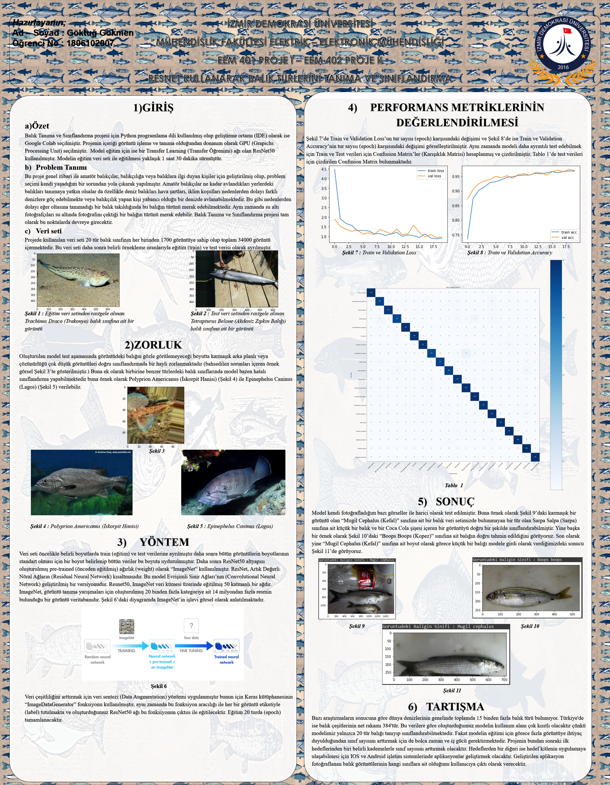

# Graduation-Thesis-Automated-Fish-Species-Recognition-via-ResNet-50-Architecture
(Graduation Thesis) This study implements a ResNet-50 based deep learning model for automated fish recognition. The project utilizes convolutional neural networks to classify various species, providing a robust computational tool for marine biodiversity assessment and real-time identification.
## Project Poster

[Click here to download the full PPTX version](./Project%20Poster.pptx)
